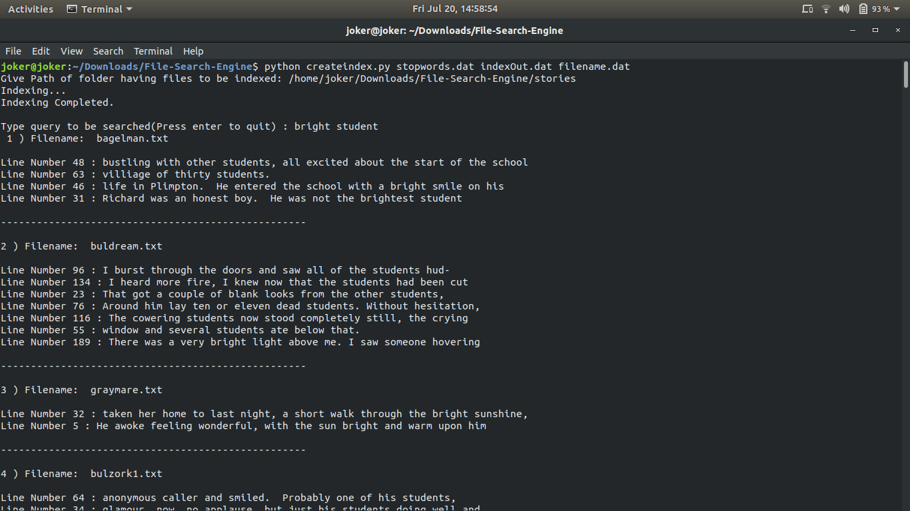

# Text_File_Search_Engine

- This is python based search engine for text files. It searches through various text files to search for a particular text/phrase provided by the user.
- It has been implemented in 3 steps:
  - Indexing
  - Phrase Search
  - Ranking
 
## Features:
-  Ignores indexing of words present in ```stopword.dat``` since they are very commonly used words.
- Stemming of words is done with help of Porter Stemmer so as to ignore different types of verbs.
- Querying options include: free text query (both one word and multi word queries) and phrase query. For testing phrase query, a normal query has to be put in double quotes ("<query>").
- Prints the file name and the corresponding lines containing the query elements.
- Ranks the documents on the basis of [OKAPI BM-25](https://en.wikipedia.org/wiki/Okapi_BM25).

## How to run?
```
python2 createindex.py stopwords.dat indexOut.dat filename.dat
```
After running the above, a prompt will ask for the path to the folder having the files to be indexed.
After the path is given, words in all the files, under that path, will be indexed in ```indexOut.dat``` file.
Now, the user has the option to Search by typing a query or can Quit by pressing <Enter> key.
Next, if the user wants to search some query again (and not perform indexing again because that takes time), one can run the following command :-

```
python2 queryindex.py stopwords.dat indexOut.dat filename.dat
```
Here, the user has to again enter the path to the folder having the files that were indexed previously.
The output consists of: the filename, the line number in that file and the line having the query elements that the user searched for.

Here is a screenshot for reference showing the result for a multi-word free text query.


